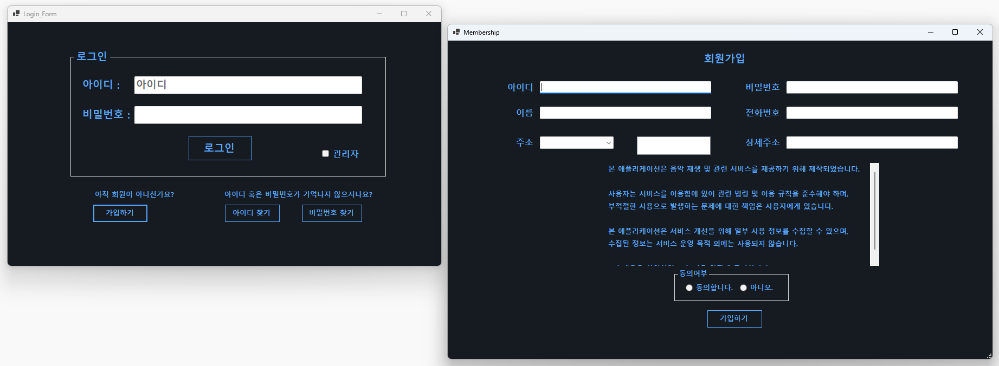
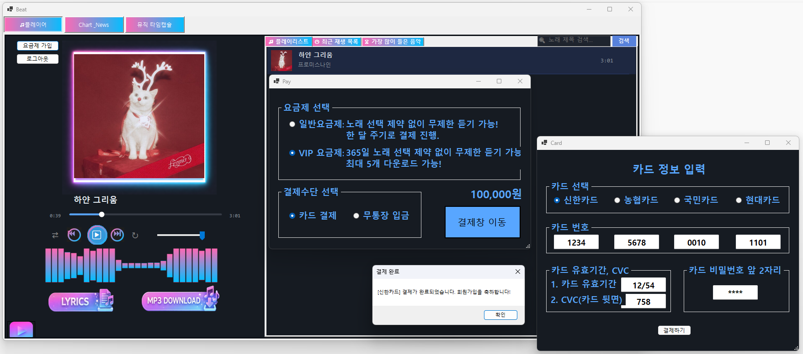
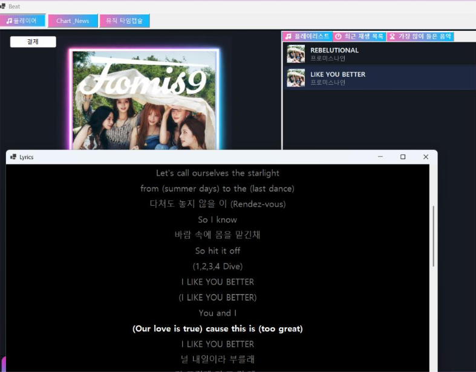
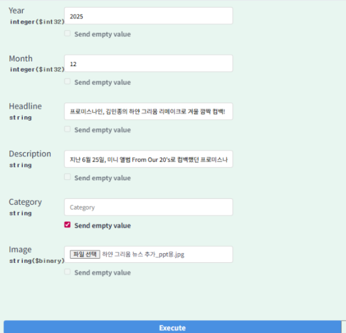
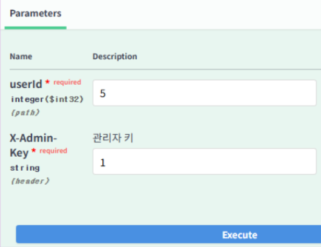
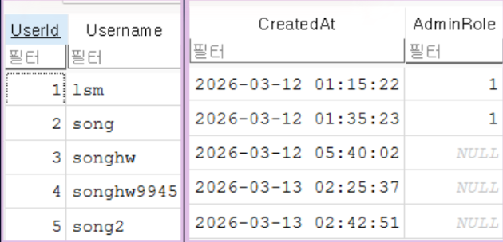
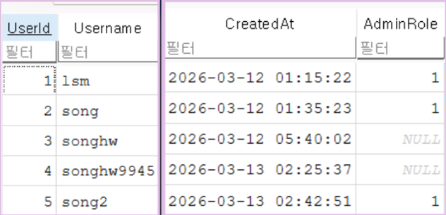

# MP3 Media Player — 담당 파트 (송현우)

C# WinForm + ASP.NET Core API + SQLite 기반 데스크톱 미디어 플레이어 **WorldBeat** 의 일부입니다.
이 저장소에는 6인 팀 프로젝트에서 **제가 담당한 코드만 발췌**해 정리했습니다.

> 전체 빌드를 위한 저장소가 아니라, 담당 기능의 구현 코드를 보여주기 위한 포트폴리오용 저장소입니다.
> `Program.cs`, `.csproj`, DB 스키마, 공용 헬퍼 등 제가 담당하지 않은 파일은 포함하지 않았습니다.

---

## 담당 기능

| 기능 | 설명 |
| --- | --- |
| 로그인 / 회원가입 | 서버 인증(API) + 비밀번호 해싱, 관리자 체크박스 검증 |
| 요금제 결제 폼 | 요금제·결제수단 선택 → 카드/무통장 폼 분기 → DB 반영 |
| 뉴스 데이터 추가 | Swagger 기반 multipart 업로드, 텍스트 먼저 저장 후 이미지 경로 연결 |
| 노래 가사 출력 | 서버에서 받은 LRC 가사를 0.3초 타이머로 싱크 강조 |
| 회원 관리자 권한 부여 | 특정 회원(userId)에게 관리자 역할을 부여/해제 |

---

## 주요 화면

| 로그인 / 회원가입 | 요금제 결제 | 가사 출력 |
| --- | --- | --- |
|  |  |  |

### 뉴스 추가 (Swagger)



### 회원 관리자 권한 부여

| 권한 부여 실행 (Swagger) | 권한 부여 전 (DB) | 권한 부여 후 (DB) |
| --- | --- | --- |
|  |  |  |

> `userId` 로 지정한 회원의 `AdminRole` 이 `NULL`(일반) → `1`(관리자) 로 바뀝니다.

> 이미지는 `docs/screenshots/` 폴더에 직접 넣어야 표시됩니다. (넣는 법은 해당 폴더의 README 참고)

---

## 폴더 구조

```
.
├── server/                      # ASP.NET Core API (서버 담당 코드)
│   ├── Controllers/
│   │   ├── AdminNewsController.cs    # 뉴스 추가/수정/삭제 API (multipart)
│   │   └── AdminSongsController.cs   # 음원 업로드 API (가사 포함)
│   ├── Services/
│   │   ├── AuthService.cs            # 회원가입/로그인 + 비밀번호 해싱
│   │   ├── SongService.cs            # 음원 메타데이터 추출/저장, 가사 응답
│   │   └── LocalFileStorageService.cs # 음원/앨범아트/뉴스이미지 파일 저장
│   ├── Repositories/                 # SQLite 접근 계층
│   ├── Models/                       # DB 엔티티
│   ├── Contracts/                    # 요청/응답 DTO
│   ├── Infrastructure/               # DB 커넥션 팩토리 인터페이스
│   └── Configuration/                # ApiOptions (AdminKey 등)
│
├── client/                      # WinForm 클라이언트 (폼 담당 코드)
│   ├── Auth/                         # Login_Form, Membership
│   ├── Payment/                      # Pay, Card, DepoBank
│   └── Lyrics/                       # Lyrics (가사 싱크 표시)
│
└── docs/screenshots/            # README용 화면 캡처
```

---

## 기능 상세

### 1. 로그인 / 회원가입
- 클라이언트(`Login_Form`, `Membership`)에서 입력을 받아 API로 전송하고, 서버(`AuthService`)가 처리합니다.
- 비밀번호는 ASP.NET `PasswordHasher` 로 해싱해 저장하며, 평문은 DB에 남기지 않습니다.
- 로그인 화면의 "관리자" 체크박스를 켰는데 실제 `AdminRole` 이 아니면 로그인을 차단합니다.

### 2. 요금제 결제
- `Pay` 에서 요금제(일반/VIP)와 결제수단(카드/무통장)을 고른 뒤, 선택에 맞는 폼(`Card`/`DepoBank`)으로 분기합니다.
- 결제 완료 시 `UpdatePaymentAsync(planType)` 를 호출해 DB의 `IsPaid`, `PlanType` 을 갱신합니다.
- 카드 번호 입력란은 4자리 자동 이동, 유효기간 자동 `/` 삽입, 비밀번호 앞 2자리 마스킹 처리를 합니다.

### 3. 뉴스 데이터 추가 (서버)
- `AdminNewsController` 가 `multipart/form-data` 로 텍스트와 이미지를 함께 받습니다.
- 텍스트(연/월/제목/내용/카테고리)를 먼저 DB에 저장해 뉴스 ID를 만든 뒤, 이미지를 파일로 저장하고 그 경로를 해당 뉴스에 연결합니다.
- 모든 쓰기 요청은 `X-Admin-Key` 헤더 검증을 통과해야 합니다.

### 4. 노래 가사 출력
- 서버에서 곡과 함께 내려준 LRC 가사를 `ParseLrc()` 로 `[mm:ss] 텍스트` 단위로 파싱합니다.
- 0.3초 타이머가 `AudioFileReader.CurrentTime` 과 대조해 현재 부르는 줄을 흰색·굵게 강조하고 화면 중앙으로 스크롤합니다.

### 5. 회원 관리자 권한 부여
- 일반 회원에게 관리자 역할을 부여하거나 해제하는 기능입니다. (`UserRepository.UpdateAdminRoleAsync`)
- `AdminRole` 값을 `1`(관리자) 또는 `null`(일반 고객)로 설정하며, 이 값에 따라 로그인 시 관리자 페이지 진입 여부가 갈립니다.
- 권한 변경 요청도 `X-Admin-Key` 검증을 통과해야 합니다.

---

## 기술 스택

| 구분 | 사용 기술 |
| --- | --- |
| 언어 | C# |
| 클라이언트 | Windows Forms (.NET) |
| 서버 | ASP.NET Core Web API |
| DB | SQLite |
| API 문서/입력 | Swagger |
| 오디오 | NAudio, TagLib# |
| 인증 | ASP.NET Core Identity PasswordHasher |

---

## 프로젝트 정보

| 항목 | 내용 |
| --- | --- |
| 기간 | 2026.03.05 ~ 2026.03.17 |
| 팀 구성 | 6인 팀 프로젝트 |
| 담당 파트 | 로그인/회원가입, 요금제 결제, 뉴스 추가(서버), 가사 출력, 회원 관리자 권한 부여 |

---

## 참고

- 이 저장소의 코드는 전체 솔루션에서 담당 부분만 발췌한 것이라 단독으로는 빌드되지 않습니다.
- 보안을 위해 실제 설정값(`appsettings.json`, AdminKey, 서버 IP, 계좌번호 등)은 포함하지 않거나 더미값으로 대체했습니다.
